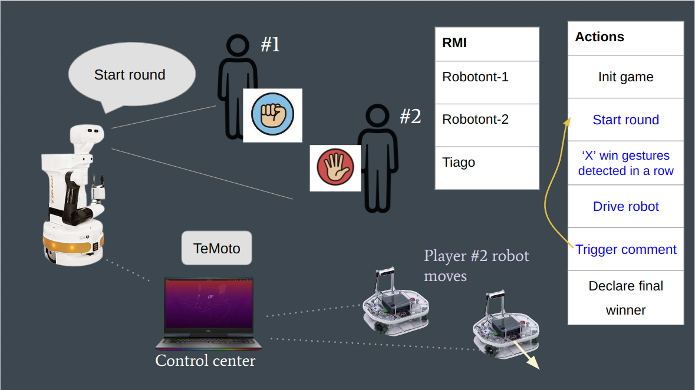
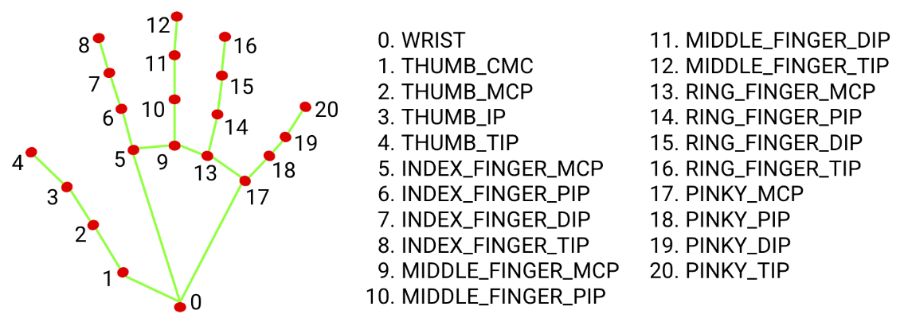
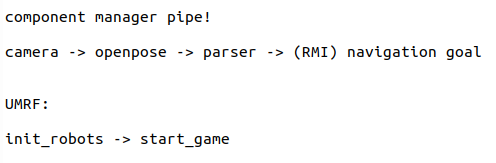

# RPSTONE, the rock-paper-scissors game

## What is this?

An ancient game with a twist. The referee is a robot, and you must accept its judgement. The game is played between two players, each of them has a robot (a simulated one) that races each other. The robots are controlled by playing rock-paper-scissors. The referee will decide who wins, and the robot of the winner gets to advance (drive forward).



## How does it work?



So Openpose cannot detect *only* the hand keypoints without providing bounding boxes (aditional hand detector on top), so it needs the whole body (of both players). Mediapipe is nice, but it cannot detect multiple persons by default (?).

The gesture_detection is done in nodejs, because the classifier lib based on finger curling works nicely, could not find easy alternatives for c++.

- The classifier only uses the keypoints of right hands, although sometime a left hand might be missdetected as a right hand by OpenPose
- The classifier will simply pick the first two persons from the Openpose output, so make sure no other person is seen in the background, otherwise it might be detected as a player.
- Player 1 is always assumed to be on the left side, and Player 2 on the right (from the camera perspective), if the players switch positions mid-game, then they are swapping their scores as well.

## Requirements
- ROS Noetic
- Nodejs v16
- [Openpose](https://github.com/CMU-Perceptual-Computing-Lab/openpose)
- [ros_openpose](https://github.com/ravijo/ros_openpose)
- [TeMoto](https://github.com/temoto-framework/temoto/wiki)
- rosbridge (`sudo apt install ros-noetic-rosbridge-server`)
- sox
- libsox-fmt-mp3

### setup

```bash
cd gesture_detector/src && npm install
catkin build
```

# How to run

If you somehow managed to get all the dependencies installed, then there is a chance you will be able to run the game

1) Launch rpstone temoto:
```bash
roslaunch rpstone temoto.launch temoto_namespace:=rpstone
```

2) Start the game by publishing the following URMF:
```bash
rosrun temoto_action_engine umrf_graph_publisher rps_game.umrfg.json rpstone
```

### Gesture classifier components can be run individually
```bash
roslaunch usb_cam usb_cam-test.launch
```

```bash
roslaunch ros_openpose run.launch camera:=nodepth
```

```bash
roslaunch gesture_detector classifier_nodepth.launch
```

### example results from a rosbag:

```bash
# Bag that contains /frame messages containing hand keypoints (Openpose) and /rps_gestures from the classifer
# rosbag play --loop rpstone/bags/rps.bag
roslaunch rpstone bag_gestures.launch
```

## Ok, let's temoto
```bash
roslaunch rpstone temoto.launch temoto_namespace:=rpstone
```

Start the game by publishing the following URMF
```bash
rosrun temoto_action_engine umrf_graph_publisher rps_game.umrfg.json rpstone
```

To launch just the component pipe:
```bash
rosrun temoto_action_engine umrf_graph_publisher ta_rps_pipe.umrfg.json rpstone
```

To work with a rosbag instead of OpenPose, plase make sure that the main pipe method at `rpstone/config/pipes.yaml` is commented out which will make the program run from a rosbag

<br/>



## Todo (updated: 22.06)
- [x] Add gesture classifier node
- [x] Implement component pipe
- [x] Add a graph for robot init and viz actions
- [x] Main game logic
- [x] SFX
- [ ] Try it with physical robots


<br/>
<br/>
__________________________________________________________________________________________